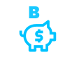

<div align="center" id="top"> 
  

  &#xa0;

  <!-- <a href="https://vgbank.netlify.app">Demo</a> -->
</div>

<h1 align="center">Vgbank</h1>

<!-- Status -->

<!-- <h4 align="center"> 
	🚧  Vgbank 🚀 Under construction...  🚧
</h4> 

<hr> -->

<p align="center">
  <a href="#dart-about">Sobre</a> &#xa0; | &#xa0; 
  <a href="#sparkles-features">Features</a> &#xa0; | &#xa0;
  <a href="#rocket-technologies">Tecnologias</a> &#xa0; | &#xa0;
  <a href="#white_check_mark-requirements">Requisitos</a> &#xa0; | &#xa0;
  <a href="#checkered_flag-starting">Como inciar</a> &#xa0; | &#xa0;
  <a href="#memo-license">License</a> &#xa0; | &#xa0;
  <a href="https://github.com/{{YOUR_GITHUB_USERNAME}}" target="_blank">Autor</a>
</p>

<br>

## :dart: Sobre ##

Banco fictício, apenas para aprimorar meu portfólio!

## :sparkles: Features ##

:heavy_check_mark: Escreva seu nome no campo e salve para visualizar-lo no cartão ;\
:heavy_check_mark: Mostrar e esconder saldo na área de finanças;\
:heavy_check_mark: Interação com usuário ao passar mouse nos extratos;\
:heavy_check_mark: Nome no campo do cartão salva no local storage;\


## :rocket: Tecnologias ##

Ferramentas utilizadas no projeto:

- [React](https://pt-br.reactjs.org/)
- [React Router](https://reactrouter.com/)
- [React Icons](https://react-icons.github.io/react-icons/)

## :white_check_mark: Requirements ##

Antets de inciar :checkered_flag:, você precisa ter [Git](https://git-scm.com) e [Node](https://nodejs.org/en/) inistalado na sua máquina.

## :checkered_flag: Starting ##

```bash
# Clone esse projeto
$ git clone https://github.com/vgabrielk/vgbank

# Acesse o diretório
$ cd vgbank

# Instale as dependências ( Node modules )
$ npm install

# Rode o projeto
$ npm run dev  

# O servidor irá inicializar na porta <http://localhost:3000>
```

## :memo: License ##


Made by <a href="https://github.com/vgabrielk" target="_blank">VITOR FELIX</a>

&#xa0;

<a href="#top">Voltar ao topo</a>
